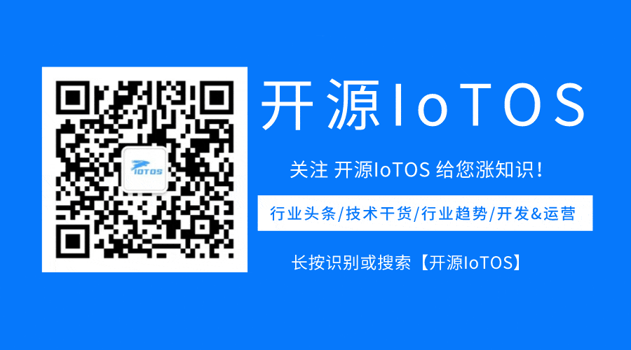

# IoTOS-IM

> The backend program is https://gitee.com/chinaiot/iotos

> The mobile terminal program is https://gitee.com/chinaiot/iotos-im

### An efficient and practical IoTCard management & operation system - message middleware (network communication can be extended to other protocol access or internal system chat, etc.).

# Related open source series

- [IoTOS](https://gitee.com/chinaiot/iotos) is developed based on [RuoYi-Vue](https://gitee.com/y_project/RuoYi-Vue?_from=gitee_search) for international multilingual use The IoTCard management business focuses on efficient, robust, and flexible design of SaaS, multilingual, robot push, automated management, and data synchronization multi-type algorithms.
- [IoTOS-App](https://gitee.com/chinaiot/iotos-app) developed based on [RuoYi-App](https://gitee.com/y_project/RuoYi-App?_from=gitee_search) Use [uView](https://gitee.com/umicro/uView) to optimize multilingual UI
- [IoTOS-IM](https://gitee.com/chinaiot/iotos-im) Based on [J-IM](https://gitee.com/xchao/j-im?_from=gitee_search)([t- io](https://gitee.com/tywo45/t-io?_from=gitee_search) network framework Tan chat prototype core) extension development

English / [中文](README.md)

          
          
<a target="_blank" href='https://gitee.com/chinaiot/iotos-im/stargazers'></img></a>
<a target="_blank" href='https://gitee.com/chinaiot/iotos-im/members'></img></a>

> Other Portfolio Project Frameworks
- [IoTOS](https://gitee.com/chinaiot/iotos) An efficient and practical IoTCard management & operation system
- [IoTOS-App](https://gitee.com/chinaiot/iotos-im) developed based on [RuoYi-App](https://gitee.com/y_project/RuoYi-App?_from=gitee_search) Multilingual UI using [uView](https://gitee.com/umicro/uView), integrated [J-IM](https://gitee.com/xchao/j-im?_from=gitee_search)([t -io](https://gitee.com/tywo45/t-io?_from=gitee_search) network framework Tan chat prototype core)

> Based on [J-IM](https://gitee.com/xchao/j-im?_from=gitee_search) architecture integrated into [IoTOS](https://gitee.com/chinaiot/iotos) and [IoTOS-App ](https://gitee.com/chinaiot/iotos-im) network communication

# 1. About IoTOS-IM

> At present, it is only connected as a system notification middleware as a chat software for message forwarding (the network communication can be expanded to other protocol access or internal system chat, etc.)

# 3. Contact us

If you want to join our open source exchange group, have any ideas, opinions or suggestions on IoTOS products, or business cooperation needs, please scan the QR code to add IoTOS project authors and join the group chat:

- WeChat

- WeChat public account

